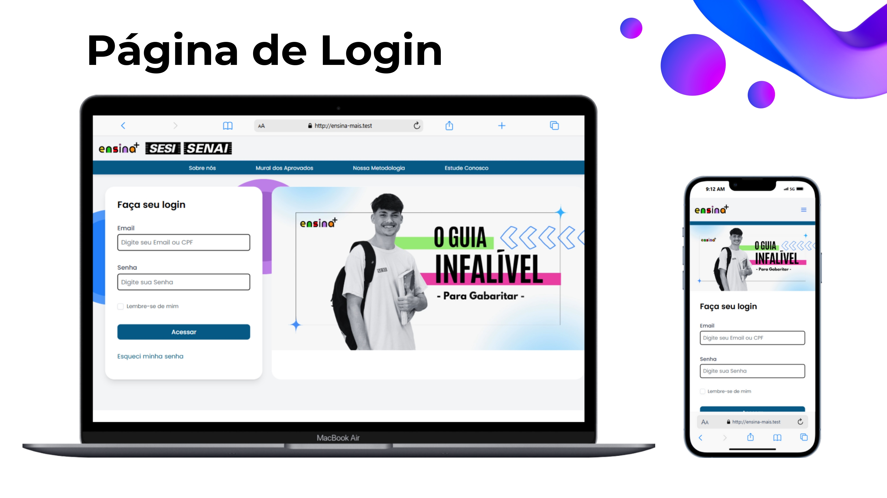
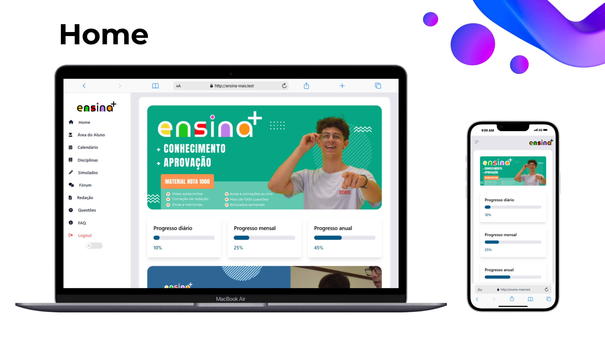
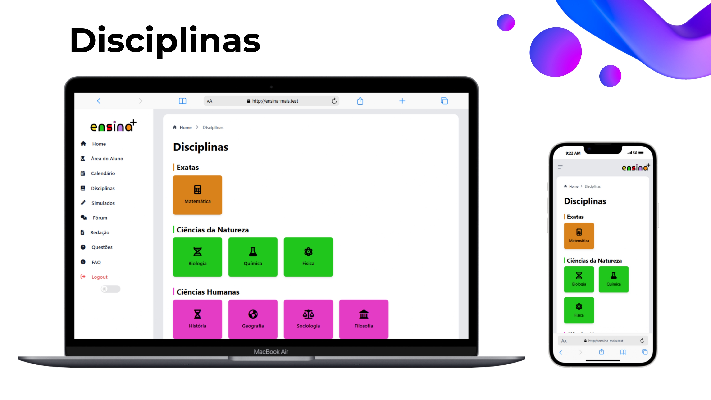
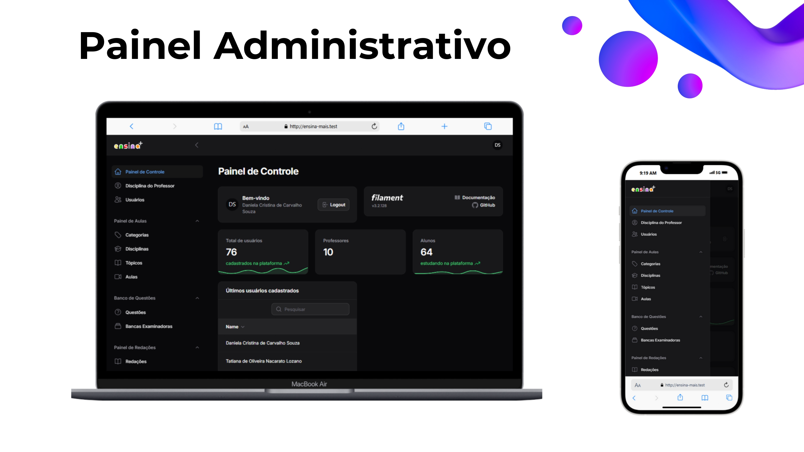

# Ensina+
Ensina+ é uma plataforma educacional digital desenvolvida para os alunos da rede SESI-SP, com o objetivo de melhorar a preparação para vestibulares, promovendo uma experiência personalizada, acessível e integrada.

- [Objetivo](#objetivo)
- [Funcionalidades](#funcionalidades)
- [Demonstração Visual](#demonstração-visual)
- [Tecnologias Utilizadas](#tecnologias-utilizadas)
- [Benefícios para a Rede SESI-SP](#benefícios-para-a-rede-sesi-sp)
- [Contribuidores](#contribuidores)
- [Próximos Passos](#próximos-passos)

### Objetivo
Atualmente, muitos alunos do SESI recorrem a plataformas externas para complementar seus estudos. O Ensina+ busca preencher essa lacuna, aproveitando a infraestrutura de alta qualidade e os professores excepcionais do SESI para criar um ambiente digital próprio e inovador.

### Funcionalidades
- Videoaulas: Aulas dinâmicas e organizadas por disciplinas.
- Correção de Redações: Ferramenta para prática e feedback estruturado.
- Acompanhamento Personalizado: Relatórios de desempenho individualizados.
- Fórum de Interação: Comunicação direta com professores e outros alunos.
- Painel Administrativo: Gerenciamento eficiente para professores e coordenadores.

### Demonstração Visual
Abaixo estão capturas de tela reais da plataforma Ensina+, mostrando algumas de suas principais funcionalidades:

### Tecnologias Utilizadas
- Design e Prototipação: Figma e Pacote Adobe (para edição dos vídeos)
- Desenvolvimento Front-End e Back-End: Laravel, PHP, TailwindCSS, MySQL.

### Benefícios para a Rede SESI-SP
Promoção da inovação e qualidade educacional.
Redução da dependência de plataformas externas.
Melhor desempenho dos alunos nos vestibulares.
Inclusão e acessibilidade no aprendizado digital.

### Contribuidores
O desenvolvimento foi realizado pelos alunos dos cursos de Desenvolvimento de Sistemas e Técnico em Multimídia - CE SESI 227, sendo este o projeto final entregue pelos alunos.

### Próximos passos
- Expansão: Incluir mais unidades e turmas do SESI.
- Inteligência Artificial: Introdução de IA para personalizar o aprendizado.
- Gamificação: Incentivar o engajamento através de desafios e recompensas.
- Métricas Avançadas: Melhorar o acompanhamento de professores e coordenadores.
