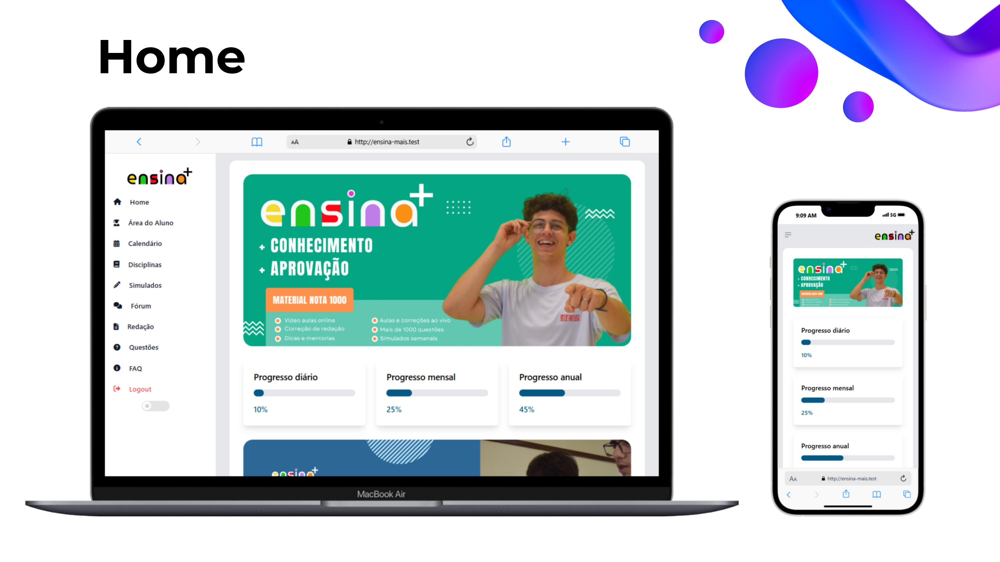
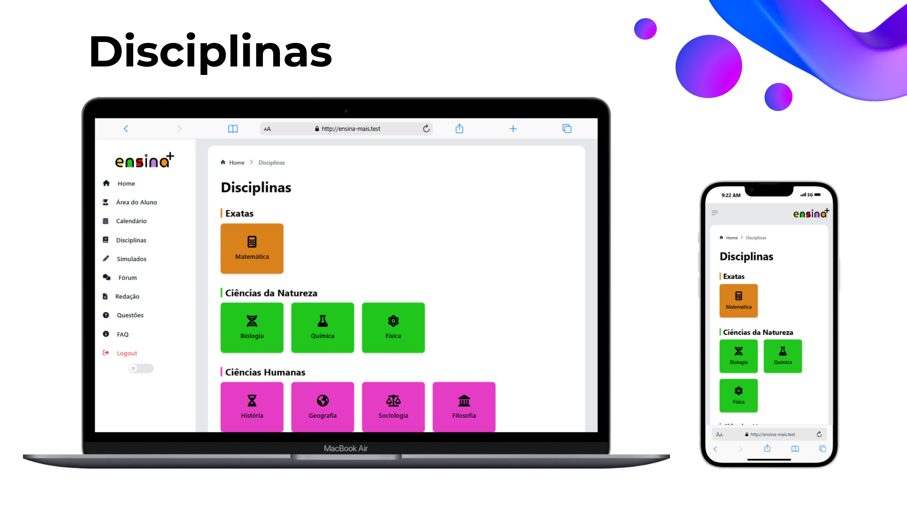
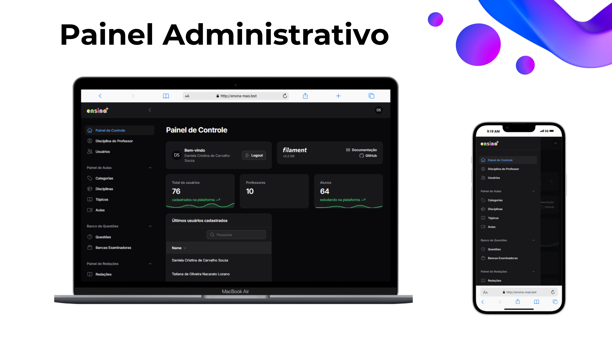

<p align="center">
    
</p>

# Ensina+
Ensina+ é uma plataforma educacional digital desenvolvida para os alunos da rede SESI-SP, com o objetivo de melhorar a preparação para vestibulares, promovendo uma experiência personalizada, acessível e integrada.

- [Objetivo](#objetivo)
- [Funcionalidades](#funcionalidades)
- [Demonstração Visual](#demonstração-visual)
- [Tecnologias Utilizadas](#tecnologias-utilizadas)
- [Benefícios para a Rede SESI-SP](#benefícios-para-a-rede-sesi-sp)
- [Contribuidores](#contribuidores)
- [Próximos Passos](#próximos-passos)
- [Guia de Instalação e Execução](#guia-de-instalação-e-execução)

### Objetivo
Atualmente, muitos alunos do SESI recorrem a plataformas externas para complementar seus estudos. O Ensina+ busca preencher essa lacuna, aproveitando a infraestrutura de alta qualidade e os professores excepcionais do SESI para criar um ambiente digital próprio e inovador.

### Funcionalidades
- **Videoaulas:** Aulas dinâmicas e organizadas por disciplinas.
- **Painel Administrativo:** Gerenciamento eficiente para professores e coordenadores.
- **Fórum de Interação:** Comunicação direta com professores e outros alunos.
- **Correção de Redações:** Ferramenta para prática e feedback estruturado.
- **Acompanhamento Personalizado:** Relatórios de desempenho individualizados.


### Demonstração Visual
Abaixo estão capturas de tela reais da plataforma Ensina+, mostrando algumas de suas principais funcionalidades:








### Tecnologias Utilizadas
- **Design e Prototipação:** Figma e Pacote Adobe (para criação do logotipo e edição dos vídeos da plataforma)
- **Desenvolvimento Front-End:** HTML, CSS, JavaScript, TailwindCSS, Blade (Laravel)
- **Desenvolvimento Back-End:** Laravel (PHP), Node.js, MySQL

### Benefícios para a Rede SESI-SP
Em caso de sua adoção oficial, o projeto poderia trazer vários benefícios para a Rede SESI-SP, como:
1. Promoção da inovação e qualidade educacional.
2. Redução da dependência de plataformas externas.
3. Melhor desempenho dos alunos nos vestibulares.
4. Inclusão e acessibilidade no aprendizado digital.

### Contribuidores
O desenvolvimento foi realizado pelos alunos dos cursos *Técnico em Análise e Desenvolvimento de Sistemas* e *Técnico em Multimídia* - CE SESI 227, sendo este o projeto final entregue pelos alunos.

### Próximos passos
- **Expansão:** Incluir mais unidades e turmas do SESI.
- **Inteligência Artificial:** Introdução de IA para personalizar o aprendizado.
- **Gamificação:** Incentivar o engajamento através de desafios e recompensas.
- **Métricas Avançadas:** Melhorar o acompanhamento de professores e coordenadores.

---

## Guia de Instalação e Inicialização

Siga os passos abaixo para configurar o ambiente de desenvolvimento local.

### Pré-requisitos
Certifique-se de ter os seguintes itens instalados em sua máquina:
- [PHP](https://www.php.net/)
- [Composer](https://getcomposer.org/)
- [Node.js & npm](https://nodejs.org/)
- [MySQL](https://www.mysql.com/)

### 1. Clonando o Repositório

Abra o terminal e execute o comando abaixo para clonar o projeto:
```bash
git clone https://github.com/caio-pellegrini/ensina-mais.git
```

Acesse a pasta do projeto:
```bash
cd ensina-mais
```

### 2. Configuração do Projeto

1. Instale as dependências do PHP e do Node.js:
   ```bash
   composer install
   npm install
   ```
2. Crie o arquivo de variáveis de ambiente:
   No Windows (Prompt de Comando):
   ```cmd
   copy .env.example .env
   ```
   No Linux, macOS ou Git Bash:
   ```bash
   cp .env.example .env
   ```
3. Gere a chave de criptografia da aplicação:
   ```bash
   php artisan key:generate
   ```
4. Configure as credenciais do banco de dados no arquivo `.env`:
   ```env
   DB_CONNECTION=
   DB_HOST=
   DB_PORT=
   DB_DATABASE=
   DB_USERNAME=
   DB_PASSWORD=
   ```
5. Execute as *migrations* para preparar o banco de dados (criação das tabelas):
   ```bash
   php artisan migrate
   ```
   *(Caso o projeto necessite de dados iniciais, você pode usar `php artisan migrate --seed`)*

### 3. Executando a Aplicação

1. Em um terminal, inicie a compilação de assets do front-end:
   ```bash
   npm run dev
   ```
2. Em um outro terminal, inicie o servidor embutido do Laravel:
   ```bash
   php artisan serve
   ```
3. Acesse a aplicação no seu navegador atráves de `http://127.0.0.1:8000`.
